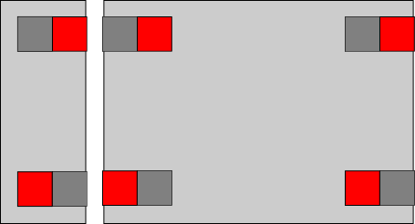
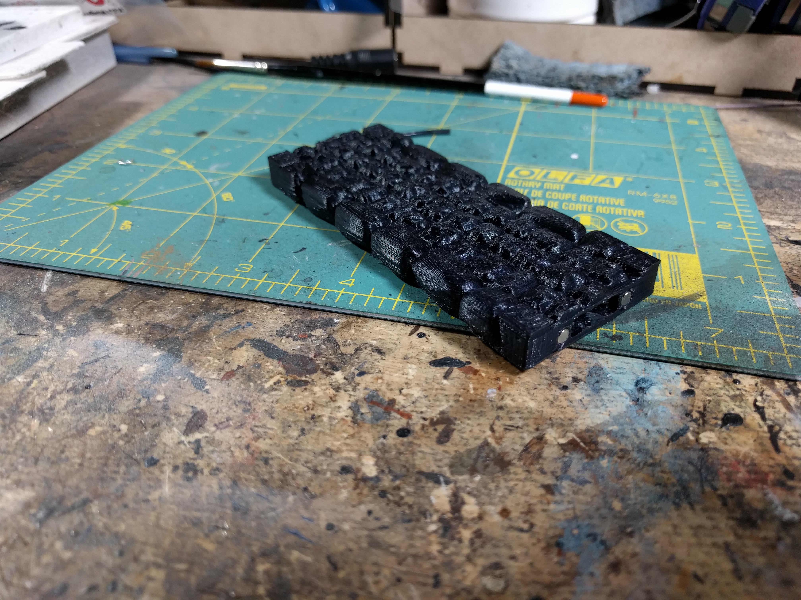
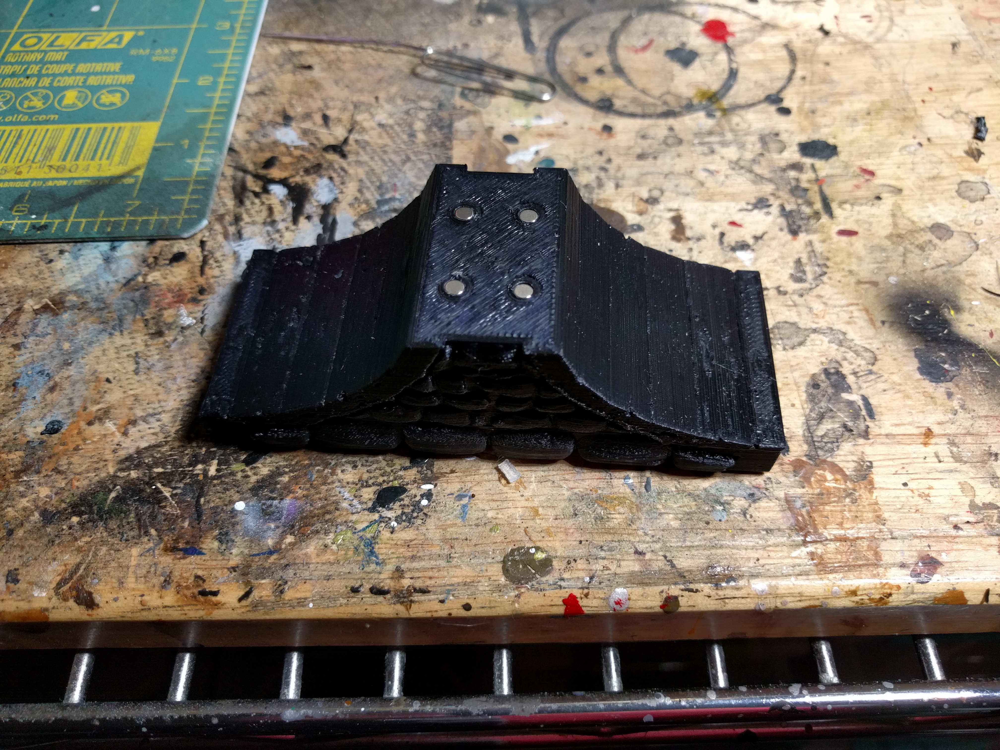
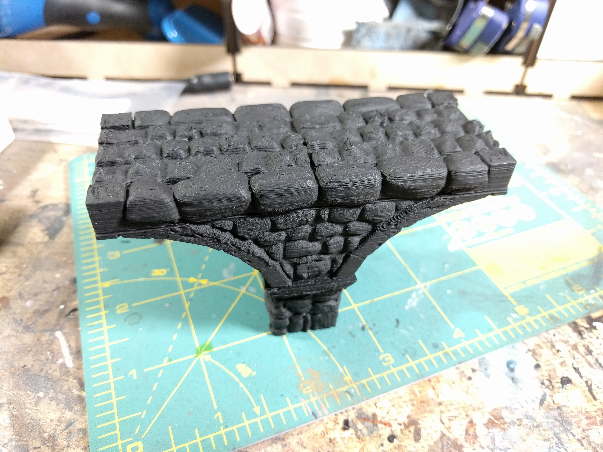
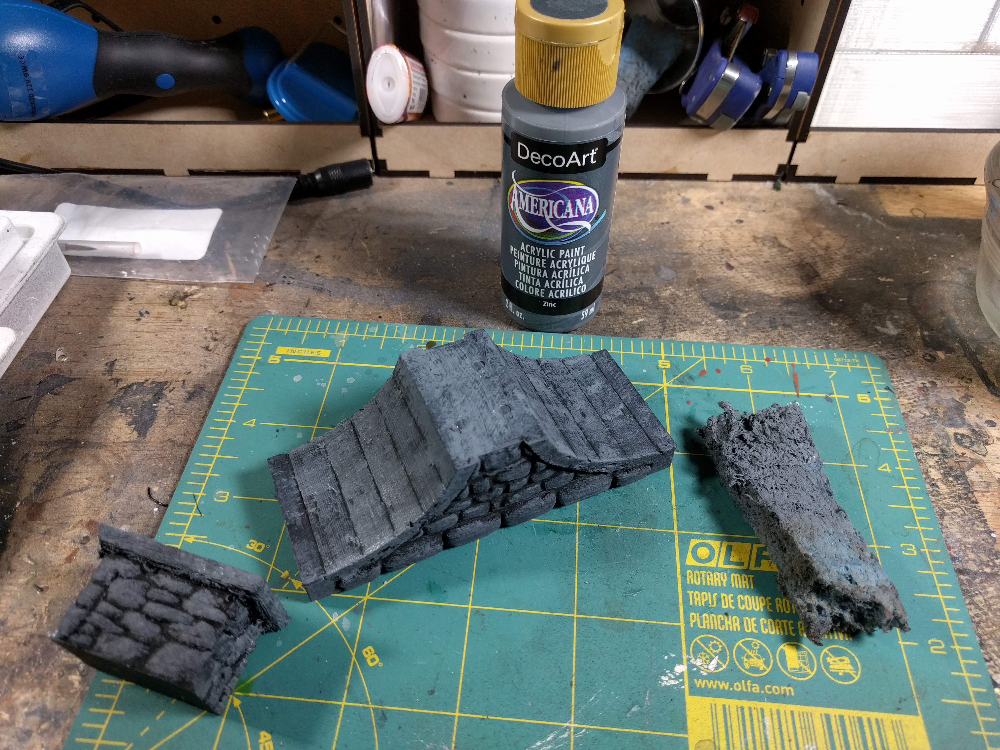
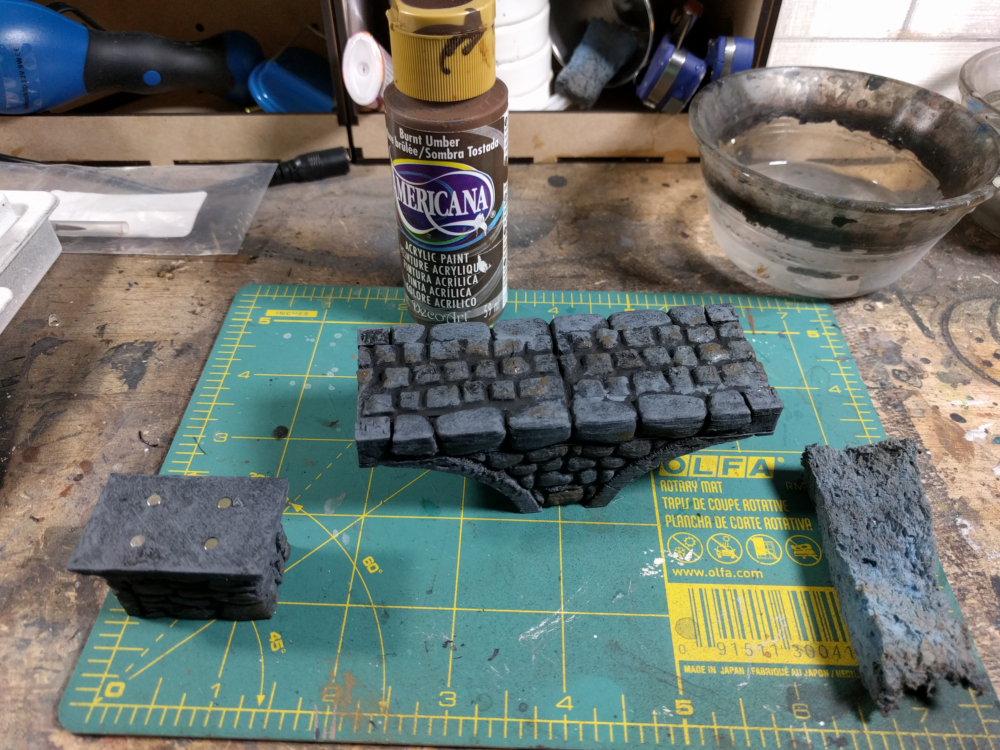
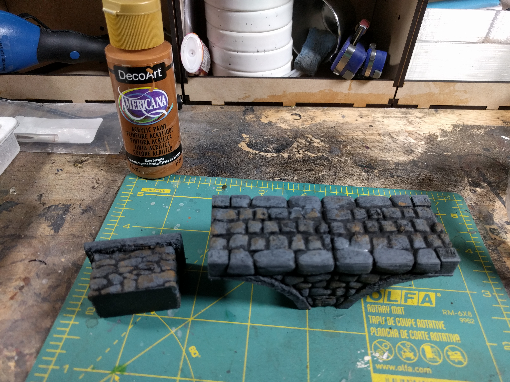
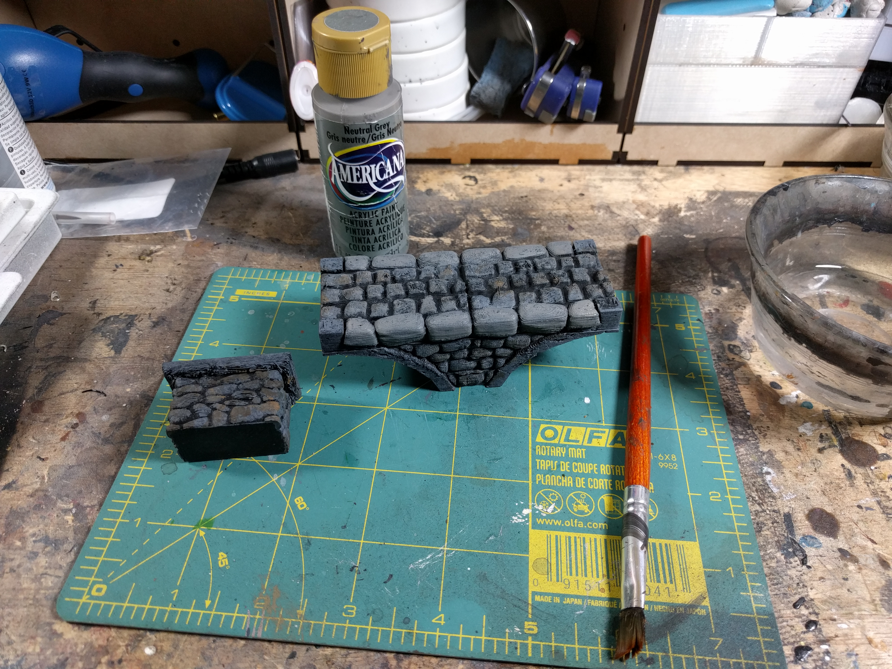
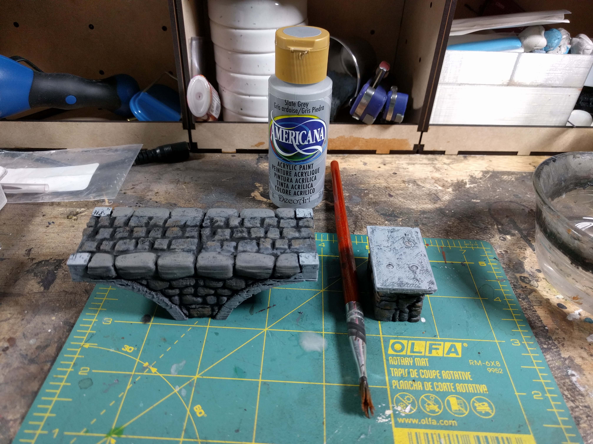
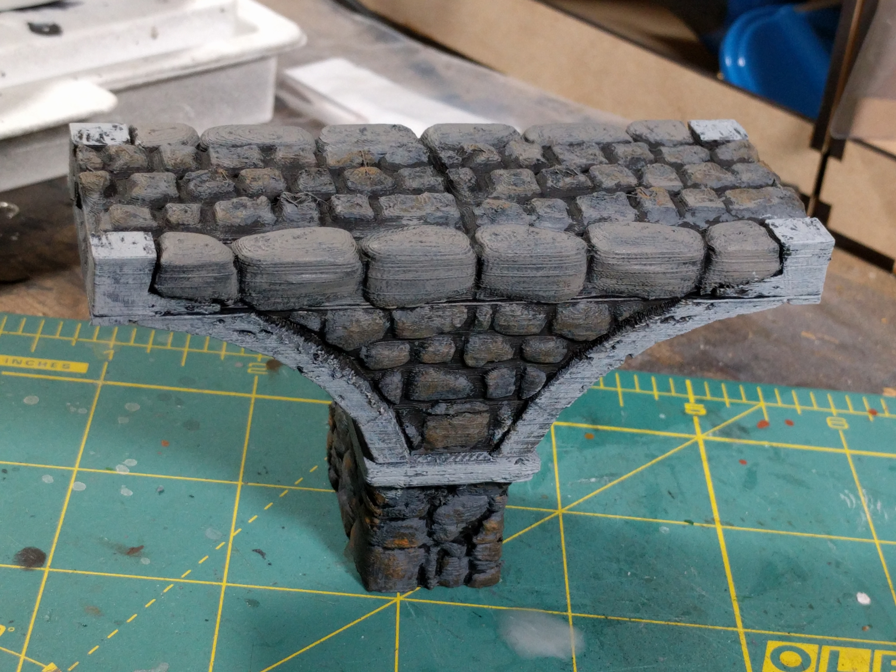

# Bridge Paint Guide
[Up to other guides](../README.md)

You need the following:
* [Gorilla Super Glue Gel](http://amzn.to/2H58rEX)
* [Krylon Fusion](http://amzn.to/2C8XG0L) Flat Black Camo Primer (or other black primer)
* Americana (or other) Craft Paints
  * [Zinc](https://decoart.com/Merchant2/merchant.mvc?Session_ID=9dfbaac54a360cee1f9f4ea541267a45&Screen=PROD&Store_Code=D&Product_Code=DA304-3&Category_Code=DA-2)
  * [Burnt Umber](https://decoart.com/Merchant2/merchant.mvc?Session_ID=9dfbaac54a360cee1f9f4ea541267a45&Screen=PROD&Store_Code=D&Product_Code=DAO64-3&Category_Code=DA-2)
  * [Honey Brown](https://decoart.com/Merchant2/merchant.mvc?Session_ID=9dfbaac54a360cee1f9f4ea541267a45&Screen=PROD&Store_Code=D&Product_Code=DA163-3&Category_Code=DA-2)
  * [Neutral Grey](https://decoart.com/Merchant2/merchant.mvc?Session_ID=9dfbaac54a360cee1f9f4ea541267a45&Screen=PROD&Store_Code=D&Product_Code=DAO95-3&Category_Code=DA-2)
  * [Slate Grey](https://decoart.com/Merchant2/merchant.mvc?Session_ID=9dfbaac54a360cee1f9f4ea541267a45&Screen=PROD&Store_Code=D&Product_Code=DAO68-3&Category_Code=DA-2)
* Americana [Burnt Umber](http://amzn.to/2HbRqZR) (or other dark brown)
* Americana [Honey Brown](http://amzn.to/2BmMi4O) (or other light brown)
* Americana [Slate Grey](http://amzn.to/2C89rVe) or [Neutral Grey](http://amzn.to/2Eed16e) (or other light grey)
* A [paint sponge](http://amzn.to/2EEMa2A)

If you plan on magnitizing you will need:

* 3/16" dia. x 1/16" thick magnets from [K&J](https://www.kjmagnetics.com/proddetail.asp?prod=D31)
* [3/16" diameter drill bit](http://amzn.to/2oMnYSO)
* [Jewelry Mallet](http://amzn.to/2FgFwjV) (or from [Harbor Freight](https://www.harborfreight.com/double-sided-mallet-with-wooden-handle-98285.html))

## Magnitizing

When magnitizing, you will want to be pretty careful about a number of things.

1) Make sure magnets you have on the same face of a print that are next to each other are opposite polarity.  If done consistently with all the pieces, this will ensure that every piece can connect to the others regardless of how it's turned.
2) After you get one piece right, attach magnets to the piece and use that as a jig to help you push them into the hole on other parts.  This will ensure that you don't make mistakes and have to scrap a part.
3) Sometimes your printer may be overestruding a little.  If so, you'll need a 3/16" drill bit to clear out the hole.
4) If the hole is tight, put a few other magnets on top of it, and then use the rubber side of the mallet to hammer the magnet into place.

If you magnitize like I suggest in #1 above, in this picture below, you can see that no matter how the bigger block is oriented, it can still connect to the smaller block.

Here is an example of using magnets on a finished part to prepare to seat them into the new part.

Here we see the magnets hammered in, flush.  You want them flush, or even under the lip of the plastic so that the magnets aren't the primary point of contact.  the plastic has more friction, so having it be the contact is better.  Also, if your printer gets that ridge of elephant foot around the bottom of prints, use an xacto to cut that off, as it can make the final bridge not be straight.

Here we have trhe magnets seated into the bottom so that the arch can attach to a base.

## Painting
If you are going to do magnets, after the magnets are added, and after you have cleared the supports out of the OpenLOCK bays, it's time to prime with the Krylon.

Next, sponge on Zinc (or other cool dark grey) onto the bridge, hitting all surfaces, but leaving black in the cracks.  On the underside, you will want the sponge to have most paint wiped off, then rub it across the support stones of the arch at a 90 degree angle to the cracks between so that it leaves some black in the bottom of the cracks.

Next, sponge on some burnt umber on the stones on the side of the arch, and between the border stones on the top.  Avoid the border stones, and the cut stones in the actual archway.

Next, do the same with Raw Sienna.

Dry brush on some Neutral Grey (or other warm grey).  then use the Neutral Grey to paint the border stones.

Finally, paint on the Slate Grey (or other light, cool grey).  You want to paint it on the capstone of the base, as well as the stones that make up the archway.  Try to leave some black/zinc showing in the cracks and holes.

Final product:

[Up to other guides](../README.md)
