[Up to other guides](../README.md)

## Supplies

### 3d printed parts
* Doorway
* Base
* Top Bar
* Door 1 narrow for 2x1 or 2 normal for 4x1

### Paint

#### Doorway
* [Krylon Fusion](http://amzn.to/2C8XG0L) Flat Black Camo Primer (or other black primer)
* Americana (or other Craft) Paints
  * [Burnt Sienna](https://decoart.com/Merchant2/merchant.mvc?Session_ID=9dfbaac54a360cee1f9f4ea541267a45&Screen=PROD&Store_Code=D&Product_Code=DAO63-3&Category_Code=DA-2)

#### Doors and Wood
* [Brown Krylon Fusion Primer](http://amzn.to/2Et5nEm) Ultra Flat Camoflage
* Americana (or other Craft) Paints
  * [Burnt Umber](https://decoart.com/Merchant2/merchant.mvc?Session_ID=9dfbaac54a360cee1f9f4ea541267a45&Screen=PROD&Store_Code=D&Product_Code=DAO64-3&Category_Code=DA-2)
  * [Milk Chocolate](https://decoart.com/Merchant2/merchant.mvc?Session_ID=9dfbaac54a360cee1f9f4ea541267a45&Screen=PROD&Store_Code=D&Product_Code=DA174-3&Category_Code=DA-2)
  * [Honey Brown](https://decoart.com/Merchant2/merchant.mvc?Session_ID=9dfbaac54a360cee1f9f4ea541267a45&Screen=PROD&Store_Code=D&Product_Code=DA163-3&Category_Code=DA-2)

### Other Supplies
* Cyanoacrylate glue (super glue) such as [Gorilla Super Glue Gel](http://amzn.to/2H58rEX)
* Paperclips
* Wire cutters

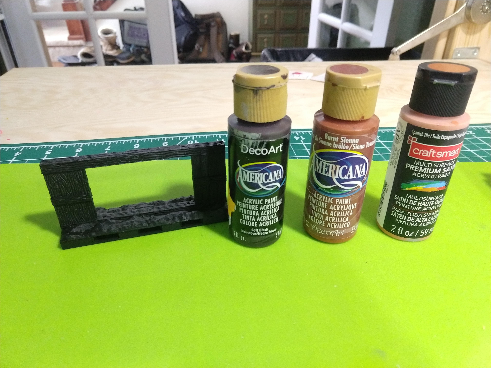
* Prime the tile in black primer. I love the Krylon Fusion paints, they are super flat and bind to plastic really well.  This also shows the colors to be used for the stone.

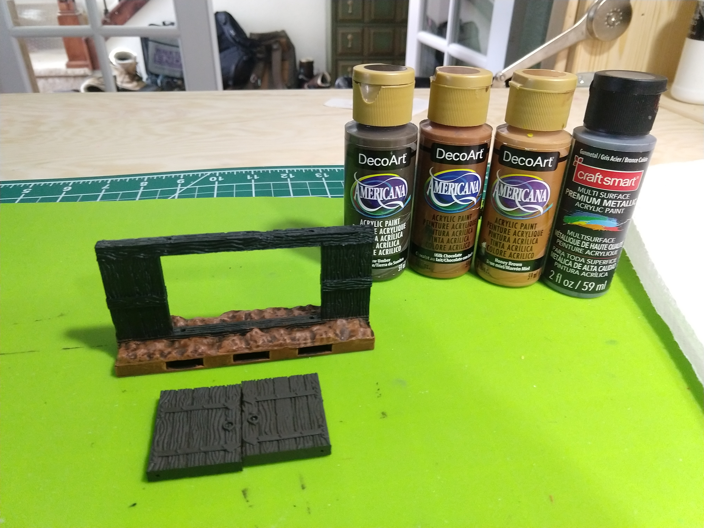
* Prime the doors in dark brown primer. This also shows the paints to be used for the doors.

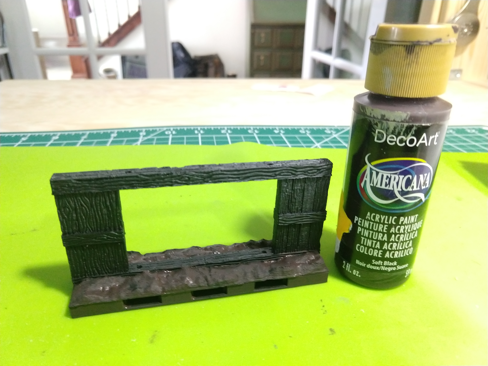

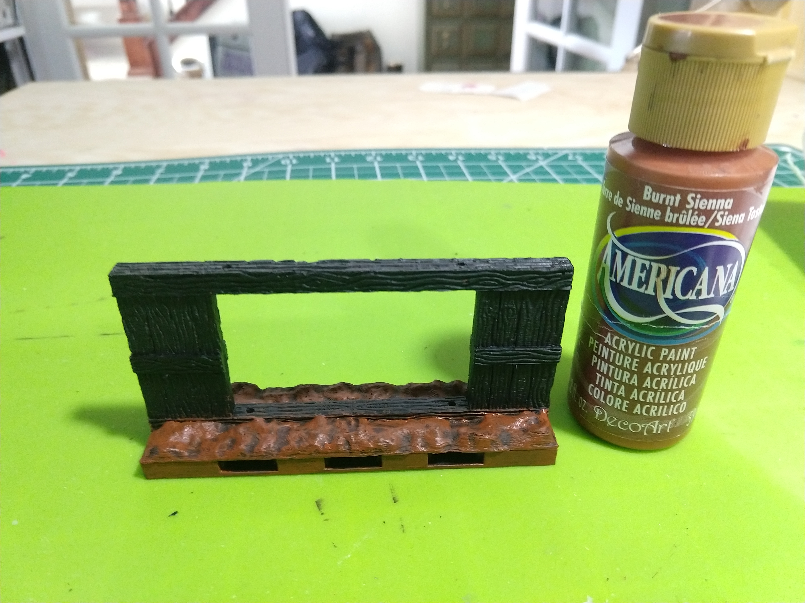

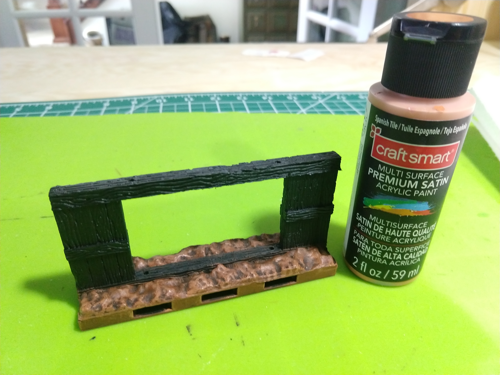

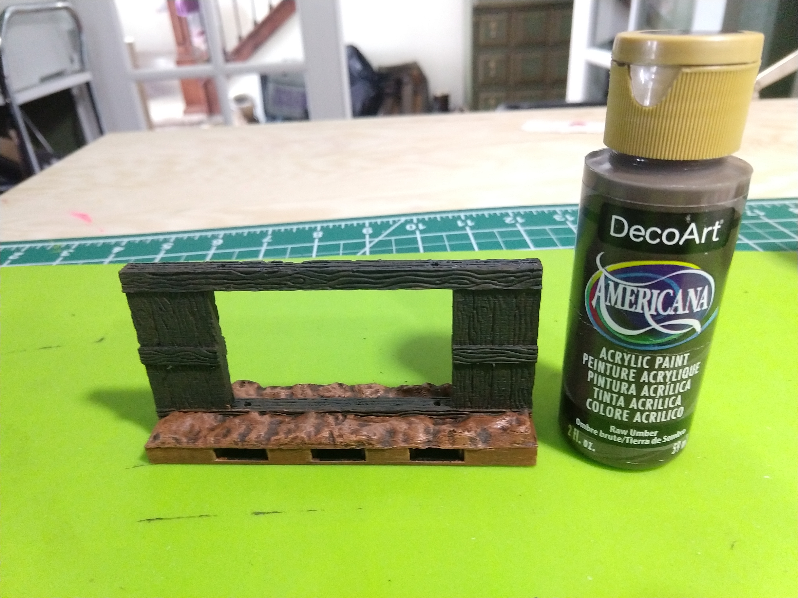

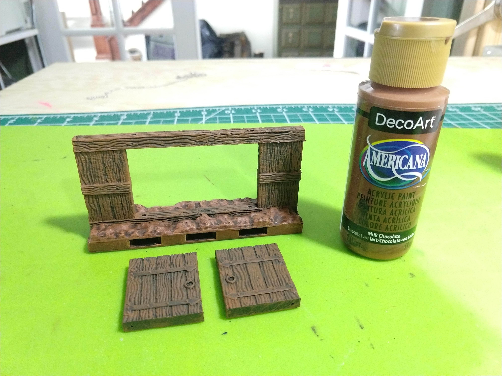

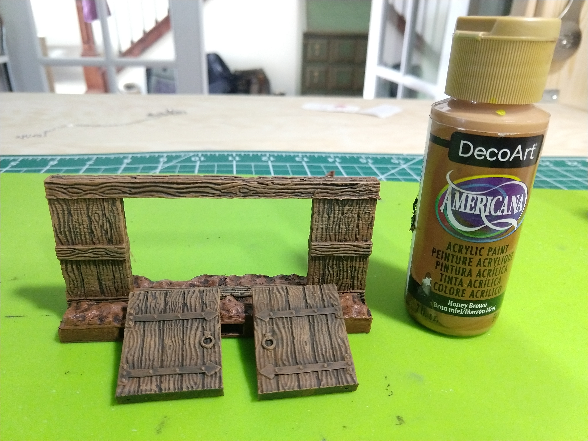

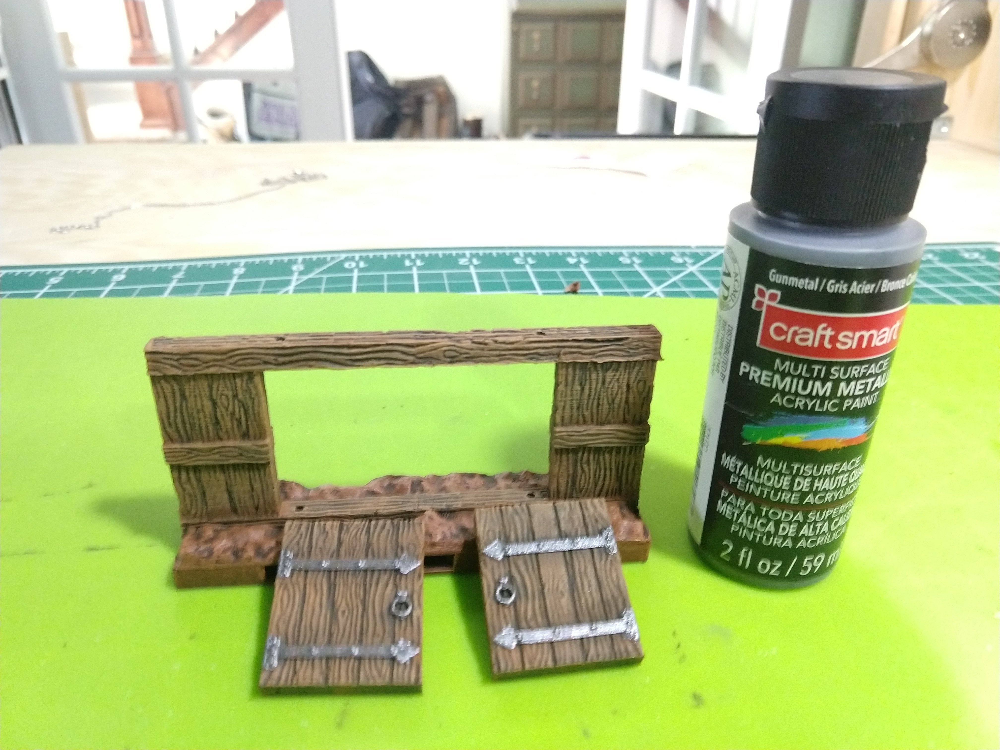

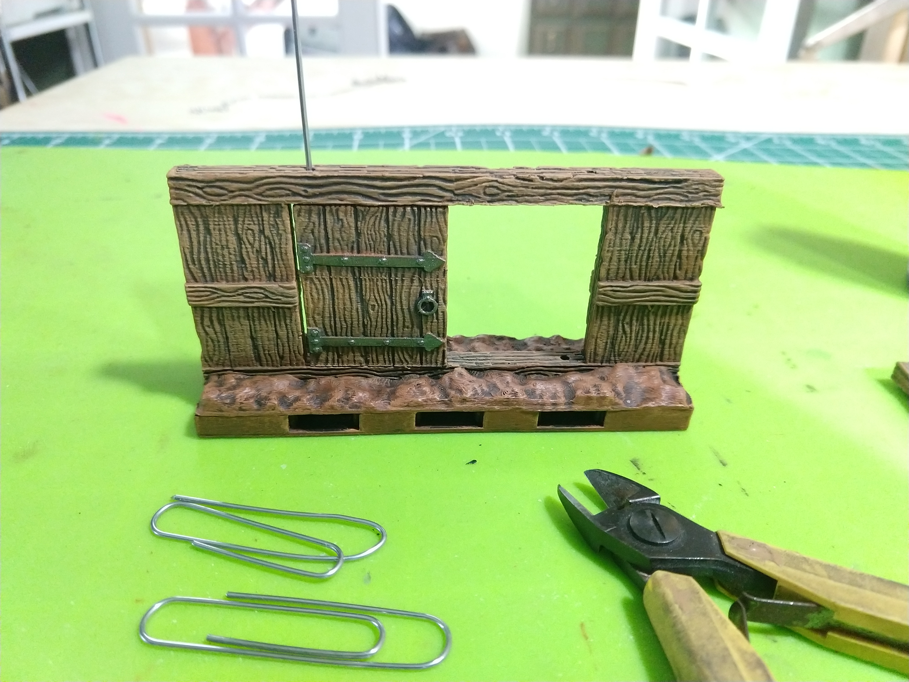

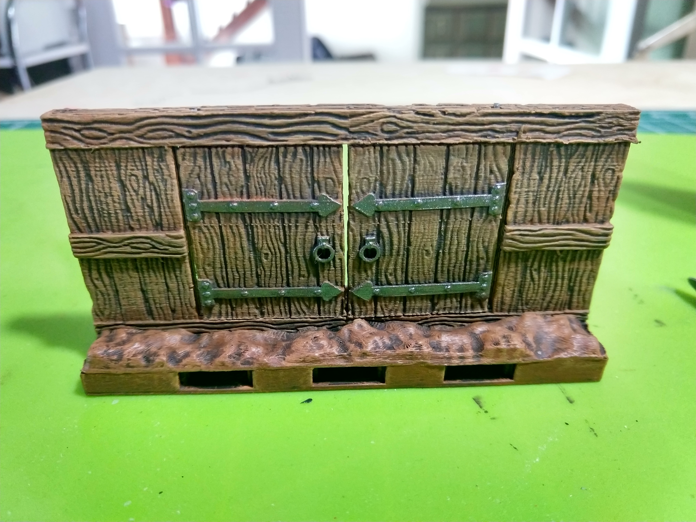

[Up to other guides](../README.md)
