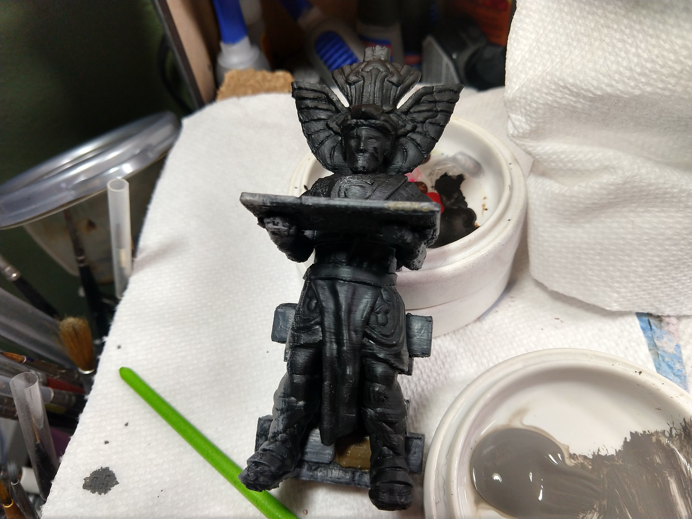
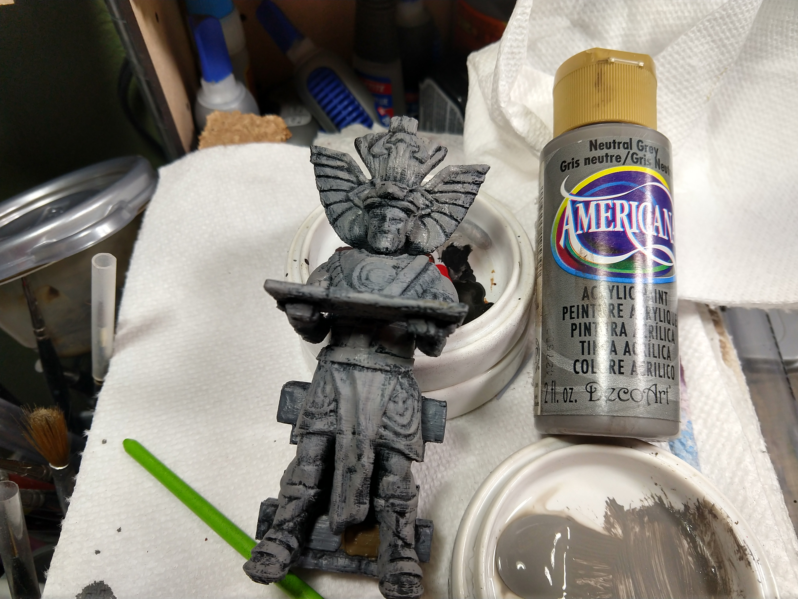
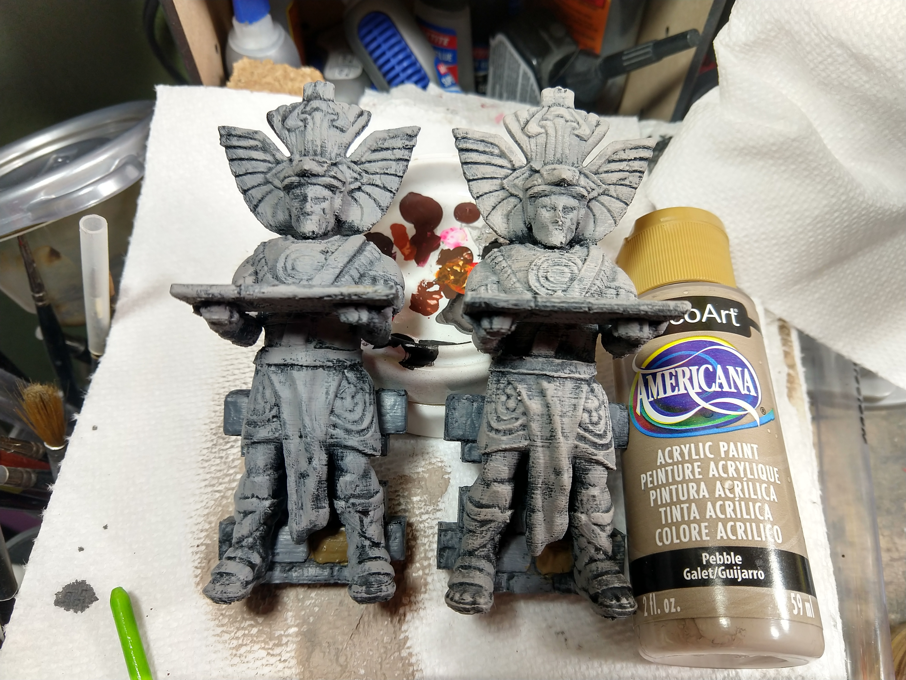
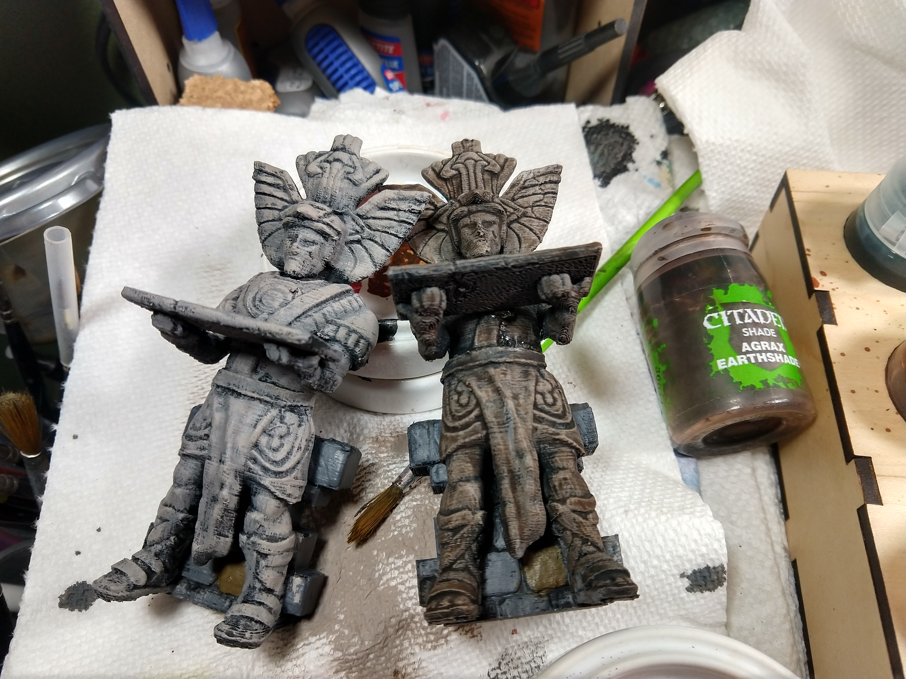
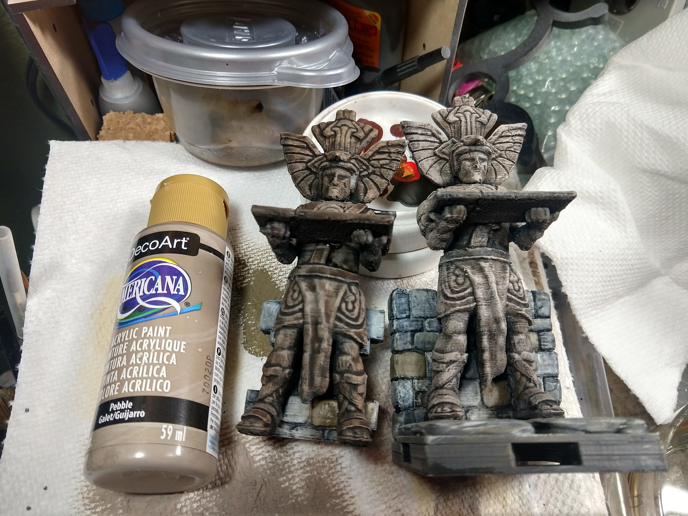

# Tamoachan Statue and Secret Door
[Up to other guides](../README.md)

You need the following:
* [Gorilla Super Glue Gel](http://amzn.to/2H58rEX)
* [Krylon Fusion](http://amzn.to/2C8XG0L) Flat Black Camo Primer (or other black primer)
* Americana (or other) Craft Paints
  * [Neutral Gray DAO95-3](https://shop.decoart.com/americana-acrylics-greys)
  * [Pebble DA303-3](https://shop.decoart.com/americana-acrylics)
* Games Workshop Washes
  * [Agrax Earthshade](https://amzn.to/2LSxTUD)

First, prime in black

Then paint in Neutral Grey.  Don't try to get it in all the crevices.

Dry brush in Pebble.  Only sweep your brush down, not up on the dry brushing step.

Wash the entire statue in Agrax Earthshade

Dry brush again in Pebble, once again only sweeping your brush down, not up.

[Up to other guides](../README.md)
