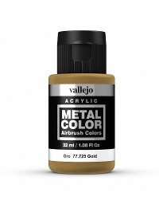

Table of Contents
=================

   * [Metallic Paints for Miniature Painting](#metallic-paints-for-miniature-painting)
      * [Cutting to the chase](#cutting-to-the-chase)
      * [References](#references)
      * [Vallejo Metal Color](#vallejo-metal-color)
      * [Badger Metalsmith](#badger-metalsmith)
      * [Vallejo Liquid Gold](#vallejo-liquid-gold)
      * [Other Metal Paints](#other-metal-paints)
   * Other Articles
      * [Paints](paints.md)
      * [Metallic Paints](metallic_paints.md)
      * [Washes/Inks](washes.md)
      * [Tools](tools.md)
      * [Techniques](techniques.md)

# Metallic Paints for Miniature Painting

## Cutting to the chase

Want to skip the rest of the document?  Here's my recommendation.  Buy 6 colors of Vallejo Metal Color.

* Gold
* Copper
* Pale Burnt Metal (which can be used as a highlight for either Gold or Copper)
* Silver (Highlight)
* Steel (Midtone)
* Magnesium (Shadow)

This will cost you around $50, which is a little steep, but these droppers are huge, so you probably won't ever need to buy them again.  You can split that up into two purchases of $25, one for silver metals, one for yellow/red metals.  If you really need to go cheap, buy Steel and Silver, and use glazes to make any other colors (sepia over silver makes a pretty decent gold.  I do not suggest using any other line of paints.

With this basic set, you can make a wide variety of golds.  The gold is a greenish gold, and you can bring that back to the red spectrum with copper.  You can also make bronze by mixing even more copper into the gold.  For any of these yellow or redish metals, the Pale Burnt Metal makes a good highlight.  I would suggest using a wash or ink to take your color to a shadow.

With white metals, you can use Magnesium as your shadow, steel as your midtone and silver as your highlight.

Beyond that, make sure you have [inks](inks.md), or Badger Metalsmith Ores/Ghost Tints if you want to do colored metals.  Paint the figure first using silver metals, and then glaze over that with the ink or tint in the color you want the metal.

## References

* [Miniac: What to Thin Metallics With?](https://www.youtube.com/watch?v=_OGFJst94Lw)
* [Miniac: What's the Best Undercoat for Metal?](https://www.youtube.com/watch?v=Iaca4TlvuC8)

## Vallejo Metal Color

* Pigment Density: High
* Container: 32ml Dropper
* Cost per ml: $0.26/ml ($8.40 dropper bottle)
* Personal level of experience: High
* Finish: Metallic

Unfortunatly, nearly all acrylic metal paints are fairly bad.  The pigments can't be ground as fine, so they tend to be really gloppy and are hard to get good results with.  There is one exception to this: Vallejo Metal Color (VMC) (not to be confused with metal paints in the game or model color lines, and not to be confused with vallejo metallics).  These metal paints are a joy to work with.  They start of already very thin, and have fantastic coverage.  I don't know what black magic Vallejo is doing with this, but they are incredible.  I basically don't use any of my other metallic paints anymore.  Don't bother with anything else.

The only real downside in them is that they only have two non 'silver' based colors, gold and copper. that being said, you can make a great bronze by mixing those two.
For a starter of vallejo metal color, I would recommend:

* [Gold](https://amzn.to/2XGUzc3)
* [Copper](https://amzn.to/2WBAe6y)
* [Pale Burnt Metal](https://amzn.to/2MKHkGj) (which can be used as a highlight for either Gold or Copper)
* [Silver](https://amzn.to/2IDyYeg) (Highlight)
* [Dark Aluminium](https://amzn.to/2MIx80N) (Shadow)
* [Steel](https://amzn.to/2IBPLOS) (Shadow)

Those 6 are probably all the metal colors you'll ever need. They are more expensive per pot than most paints at $8.40, but are also much larger at 32ml (so $0.26/ml).

References:

* [Vince Venturella: Product Review 01 - Vallejo Acrylic Metal Color](https://www.youtube.com/watch?v=XxODxALYV8o)
* [Vince Venturella: Product Review 06 - Vallejo Metal Color Copper & Gold](https://www.youtube.com/watch?v=hauVrnhIah0)
* [Vince Venturella: Hobby Cheating 104 - Zenithal Speed Painting w True Metals](https://www.youtube.com/watch?v=ByX2jIEmXJM)
* [Vince Venturella: Hobby Cheating 129 - How to Paint Colored Metallics](https://www.youtube.com/watch?v=l9q35BPaBN0)
* [Vince Venturella: Hobby Cheating 130 - How to Paint Antique Green Gold](https://www.youtube.com/watch?v=8RcdJTyDIE4)
* [Vince Venturella: Hobby Cheating 160 - How to Paint True Metallic Bronze](https://www.youtube.com/watch?v=OsueC_ee5-k)
* [Vince Venturella: Hobby Cheating 179 - Shading True Metallic Metals Revisited](https://www.youtube.com/watch?v=T-gyIO3Ncpk)

## Badger Metalsmith

* Pigment Density: High
* Container: 30ml Dropper
* Cost per ml: $0.08/ml ($2.50 dropper bottle)
* Personal level of experience: None
* Finish: Metallic with a bright shine
* Purchase: [Full Metalsmith Set](https://usaairbrushsupply.com/products/1319-bmsk-basic-metalsmith-kit-1oz-30ml) (2 paints, 3 aging bases and 5 "ores" for $26.40) or you can buy the ores individaully

This is a real interesting paint system.  They have a single base paint, it's silver.  Ther are three aging bases that darken the metal and 5 ores that are tints you can add to make the metal into gold, copper, bronze or colored metals.  The ideas is that you can create paint formulas for a specific mmetal you want to achieve.

The metal paint itself is decent, but not in the same league as Vallejo Metal Color.  However, the ores oars of great use.  They offer Gold Ore, Bronze Ore, Copper Ore, Carbon Iron Ore, Blue Ore and Red Ore, and these can either be be mixed into Vallejo Metal Ccolor to tint it, or glazed on top of it.

The same can be said for nearly any line of inks, along with the [Badger Minitare Ghost Tints](https://amzn.to/2W6Pp7u).  Using either mixed in tints like this, or glazing over the top of VMC, you can achieve any of the colored metallics.  Be sure to first learn how to do this over the silvery VMC colors before you try at all over gold or copper.

Given how cheap the ores are (8 cents per ml, wow!), these are an easy buy to justify.

References:

* [Vince Venturella: Product Review 29 Badger Metalsmith Paint System](https://www.youtube.com/watch?v=aLKfTxHuRgk)

## Vallejo Liquid Gold

* Pigment Density: Very High
* Container: 35ml Pot
* Cost per ml: $0.23/ml ($7.99 dropper bottle)
* Personal level of experience: None
* Finish: Metallic with a bright shine
* Purchase: [Vallejo Liquid Metallics Set](https://amzn.to/2KzL7nd) (4 paints fir $17.20)

I have not used these, but these are alchohol paints.  They require that you use Isopropyl Alcohol to thin them, and they dry out super fast.  They will trash brushes, so don't use good brushes with them (frankly don't use good sable brushes with any metallics).  The pigment and the binder will seperate, so you have to shake them with every use, and if you don't store them properly, the pigment and binder will seperate in a way you can't fix.  All that being said, the results from these paints is supposed to be astonishing.  They produce a shine akin to real metal that you just can't get from scrylic paints.

References:

* [Vince Venturella: Produce Review 04 - Vallejo Liquid Gold](https://www.youtube.com/watch?v=K-ePHYeIKlI)

## Other Metal Paints

* Every paint line under paints
* Darkstar molden metals

<!-- TODO: Add recipes for things like bronze, verdigris, etc -->

