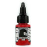
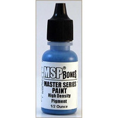
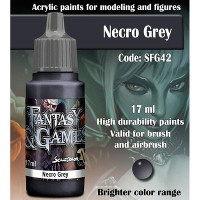
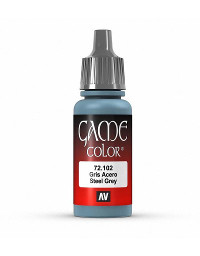
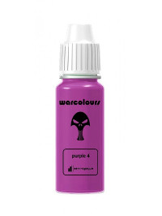

Table of Contents
=================

   * [Miniature Painting Paint Selection](#miniature-painting-paint-selection)
      * [A Note About Craft Paints](#a-note-about-craft-paints)
      * [Prices](#prices)
   * [Paints](#paints)
      * [Army Painter](#army-painter)
      * [Citadel](#citadel)
      * [Formula P3](#formula-p3)
      * [Pro-Acryl](#pro-acryl)
      * [Reaper Master Series](#reaper-master-series)
      * [Reaper MSP HD](#reaper-msp-hd)
      * [Scale 75 Fantasy and Games](#scale-75-fantasy-and-games)
      * [Vallejo Game Color](#vallejo-game-color)
      * [Warcolours](#warcolours)
      * [Other paint lines](#other-paint-lines)
   * Other Articles
      * [Paints](paints.md)
      * [Metallic Paints](metallic_paints.md)
      * [Washes/Inks](washes.md)
      * [Tools](tools.md)
      * [Techniques](techniques.md)

# Miniature Painting Paint Selection

## A Note About Craft Paints

Many people try craft paints (Americana, Folk Art, Craft Smart, etc) as their first paint to paint miniatures.  A person can achieve tabletop quality with craft paints, but they will do it having to fight the paints, instead of the paints making the job easier for them.  Miniature paints are designed to make easy techniques easy and hard techniques possible.  Craft paints are designed for straightforward techniques and low price.  The primary problems with using craft paint is that they have three problems for miniatures:

1) The pigment in craft paint is not ground as finely as model paints
2) Craft paints are not very pigment dense
3) The paints are thick, and the medium is not designed for miniature use cases.

What this means in practice is that as soon as you use anything but the most basic techniques for miniature painting, you will start to run into the limitations of this paint.  As you thin it, the low pigment density will result in the paint turning glossy and having inconsistent coverage.  The less fine pigment will mean you will have a harder time painting details and not clogging them.  You'll also find that it's much harder to avoid brush strokes.  Finally, the medium for craft paints is missing additives that most miniature paints have that increase the drying time and improve their flow.  This last one you can fix, by adding in some of your own medium.  There's a link under references for a video on how to do this.

If you are doing your painting of miniatures with the basic techniques of base coat + wash + drybrush, you can get by with them, but as soon as you start trying to do layering, wet blending, feathering, etc, the paints are going to fight you every step of the way.

I personally use a ton of craft paint, mostly for painting 3d printed terrain, so it's not a distain for craft paints, they are a useful tool in the crafter's arsenel, but they also have specific applications where they are better, and applications where they are suboptimal.  For painting miniatures, craft paints have significant drawbacks.  For painting large structures where your primary focus is on techniques like base coating, overbrushing, washing and drybrushing, craft paints are a much much cheaper alternative for painting large pieces where you don't have a need to use more advanced techniques.

References:

* [Luke's APS: Make craft paints work on your minis and terrain.](https://www.youtube.com/watch?v=xsQlKepVQE0)

## Prices

Here's your prices (All taken from miniature market's "Retail Price" except warcolours & pro-acryl since they are only sold through their websites):

* Warcolours: 15ml dropper for 1.95€ &#126; $2.19 ($0.15/ml)
* Army Painter Paint: 18ml dropper bottle for $2.99 ($0.17/ml)
* Pro-Acryl: 22 ml $4.00 ($0.18/ml)
* Vallejo Paint: 17ml dropper bottle for $3.29 ($0.19/ml)
* Two Thin Coats: 15ml dropper bottle for $3.20 ($0.21/ml)
* Reaper MSP: 1/2 oz (15 ml) for $3.29 ($0.22/ml)
* P3: 18ml paint pot for $4.00 ($0.22/ml)
* Scale 75 Paint: 17ml dropper bottle for $4.49 ($0.26/ml)
* Citadel GW Paint: 12ml paint pot for $4.55 ($0.38/ml)

Based purely on pigment density, Citadel should be selling much closer to 17 cents per ml, but instead it's the most expensive at 38 cents.  Warcolours on the other hand is the cheapest with one of the best pigment densities.

# Paints
(Note, all links and prices last updated on 2019/06/03)

My initial advice is pick a paint set, and use that for the backbone of your collection.  Once you are well grounded in painting, you can start to explore other lines.  Every line has some colors that they excel at and some colors that just suck.  

My bottom line recommendation:

* If you want the best all in one paint set, my recommendation here is to go with a vallejo game color basic set.  I can also highly recommend the reaper master paints set 1.
* If you are looking to get into painting on the cheap, you can't go wrong with army painter's sets.  As your skill grows, you can explore other sets, and add in some paint here or there.  Army painter will still be solid for you as a foundation.  You'll just need other paints when you want to explor glazing.
* If you are more experienced, you probably don't need my advice, but as a second set of paints for more advanced techniques I can strongly recommend Warcolours' layer paint set.

Finally, metallics are an exception to all of the review below.  Check the metallics section below the paint section for my metallics recommendation.

References:

* [Dr Faust's Painting Clinic: Picking Your Paint - What's the Best Paint for You?](https://www.youtube.com/watch?v=XXoWsMlsjTM)
* [Miniac: BEST Beginner Paint Set?!](https://www.youtube.com/watch?v=jrJ1Yb2QI1g)
* [Vince Venturella: Hobby Cheating 80 - Miniature Paint Brand Guide](https://www.youtube.com/watch?v=et6VmcFJpXU)

## Army Painter

* Pigment Density: Low
* Container: 18ml Dropper
* Cost per ml: $0.17/ml ($2.99 per dropper bottle)
* Personal level of experience: Medium
* Purchase starting place: [Warpaints Starter Set](https://amzn.to/2QJdyA8) (9 paints, 1 wash, 1 brush for $24.20) to try them out.  You can also get the [Mega Paint Set](https://amzn.to/2Kljnm5) (46 paints, 2 washes, 1 brush for $98.54) to get a big range or the [Wargamers Complete Paint Set](https://amzn.to/2KmXrHe) (113 paints, 11 washes, 5 brushes for $229.98) to get their full range.
* Finish: Satin

Army Painter is a good alternative to citadel.  They are very similar paints with a similar composition, but are WAY cheaper.  They are be good for layering, but like citadel will be hard to glaze with.

Like Vallejo and Warcolours, Army Painter does not sell a line of miniatures, they sell paint and painting accessories.  This is nice because it limits the degree to which they are beholden to the needs of their miniature lines.  They do however have D&D and CMON licenses.

## Citadel

* Pigment Density: Low
* Container: 12ml Paint Pot
* Cost per ml: $0.38/ml ($4.55 per paint pot)
* Personal level of experience: Low
* Purchase starting place: [Citadel Base Paint Set](https://amzn.to/2IkBaqD) (11 paints, 1 brush for $40.08) to try them out. For a few more paints, you can get the [Citadel Layer Paint Set](https://amzn.to/2KpxNBB) (20 paints, 1 brush for $66.56)
* Finish: Satin

Citadel has significant drawbacks. First it comes in paint pots, which means you will waste or ruin more paint from drying out than brands that come in dropper bottles. Second, per ounce it's one of the most expensive paints on the market. Third, citadel has one of the lowest pigment densities of any of the major miniature paint brands.  This means when you thin it, it will break faster than other paints.  It also means that it is more likely to go on gloppy.

## Formula P3

* Pigment Density: ?
* Container: 18ml Paint Pot
* Cost per ml: $0.22/ml ($4 per paint pot)
* Personal level of experience: None
* Purchase starting place: P3 has numerous sets, but the sets are all designed around factions from the Warmachine/Hordes miniatures wargame.  No single set is good for a beginner painter, but if you play the game, they can give you much of what you need to paint a faction.
* Finish: Satin

I don't actually have experience with P3.  It is well considered by many other painters.  They tout that they use liquid pigment, which makes it harder for their paint to break, but I have no idea how effective this is.  P3 does come in paint pots, which I personally do not like.  I would probably be more inclined to try them if they came in dropper bottles.

## Pro-Acryl

* Pigment Density: High
* Container: 22ml Dropper
* Cost per ml: $0.18/ml ($4.00 per dropper bottle)
* Personal level of experience: High
* Purchase starting place: [Pro-Acryl Base Set](https://monumenthobbies.com/products/pro-acryl-base-set) (24 paints)
* Finish: Matte/Satin

Pro-Acryl has become one of my go-tos.  Their white is just top notch, but I also regularly use the white, greys and black to clean up my zenithal primes from overpaint as I put colors over my zenithal prime.  All the pro-acryl paints have top tier coverage for comparable colors.  They wet blend well, they turn into glazes super-well - very very hard to break because of the very high pigment density.  A great range of browns, and desaturated colors as well as probably my favorite turquoise in any line.  Pro acryl also has a good line of metallics and some really interesting transparent paints that are great for glazing.

## Reaper Master Series

* Pigment Density: Medium
* Container: 15ml Dropper
* Cost per ml: $0.22/ml ($3.29 per dropper bottle)
* Personal level of experience: High
* Purchase starting place: [Learn To Paint Kit: Core Skills](https://amzn.to/2IeODAu) or [Learn To Paint Kit: Layer Up](https://amzn.to/2Ie86RP) (11 paints, 2 brushes, 3 miniatures) to get a sample of how they work, [Master Series Paint Bones Colors Full Set](https://amzn.to/2KoEBiX) (54 paints for $126.54) to get a larger range, or [Reaper Master Series Paint Set 1](https://amzn.to/2IeEZxR) (108 paints for $264.95) to get a significant range.
* Finish: Matte/Satin

Reaper is one of my favorites specifically for layering.  The master series sells paints in triads, which is a shadow, midtone and highlight intended for some purpose.  They sell skin triads, wood triads, verdigris triads, etc.  Reaper has a pigment density similar to vallejo.  Reaper comes pre thinned.  It's formulation has a fair amount of flow improver in it, so they are superb for layering, and thin well for glazing, and work great for wet blending.   However, they can be a bit harder to feather and dry brush with.

I personally think Reaper paints are the most comparable to Vallejo.  Like Vallejo they are a good backbone for your paint collection.  The triad concept is super useful for newer painters, but I still use the triads almost every time I paint because they help make some decisions just easier.

## Reaper MSP HD

* Pigment Density: High
* Container: 15ml Dropper
* Cost per ml: $0.22/ml ($3.29 per dropper bottle)
* Personal level of experience: Medium
* Finish: Matte/Satin

The Reaper HD line uses a higher density pigment, and a different medium than the rest of the master series paints.  This line has been discontinued, and ceased production in 2018.  You can still find them, but they are no longer being bottled.

## Scale 75 Fantasy and Games

* Pigment Density: High
* Container: 17ml Dropper
* Cost per ml: $0.26/ml ($4.49 per dropper bottle)
* Personal level of experience: Low
* Purchase starting place: Scale 75 has many sets that cover a color range such as the [Blue Sky Paint Set](https://amzn.to/2Wjc2ug), [Green Paint Set](https://amzn.to/2Kl348I) or the [Blood and Fire Paint Set](https://amzn.to/2WaFWft).  (8 paints for ~ $30) Any of these would be a good place to try them out.  For a larger set, they offer the [Fantasy & Games Collection](https://amzn.to/2WeRe25) (48 paints for $195) or the [Scalecolor Collection](https://amzn.to/2MrkV0g) (63 paints for $235)
* Finish: Ultra matte

Scale 75 is great paint, but it's one of the hardest to use, due to using a different medium formulation than most paints.  Scale 75 is designed for more for advanced techniques.  They excel at wet blending, two brush blending and glazing.  Like Warcolours, you can also thin them to layer paint.  Scale 75 paints are ultra matte, so they also excel at tasks suited towards competition painters.  Competition painters generally do not varnish, but as most paints have a satin finish, they need to be hit with a matte varnish to knock down the shine.  Scale 75 does not suffer this.  Starting out, you are probably better focusing on layer paints, as layering is generally the first skill to pick up in painting.

References:

* [Vince Venturella: Product Review 12 - Scale 75 Blue Paint Set](https://www.youtube.com/watch?v=iBglxdOvcGM)
* [Vince Venturella: Product Review 14 - Scale 75 Flesh Paint Set](https://www.youtube.com/watch?v=HRRA0ZV72xs)

## Vallejo Game Color

* Pigment Density: Medium
* Container: 17ml Dropper
* Cost per ml: $0.19/ml ($3.29 per dropper bottle)
* Personal level of experience: Medium
* Purchase starting place: [Game Color Intro Set](https://amzn.to/2IgMPH9) (16 paints for $39.40) or the [Game Color Basic Paint Set](https://amzn.to/2Wmcbxg) (72 paints, 3 brushes for $216.88)
* Finish: Satin

Vallejo is probably the most expansive line.  They have tons of great colors, and their paints have a good amount of pigment, so you can still get into the advanced techniques with them.  Vallejo sells multiple lines designed for different audiences, such as model color and mecha color.  There's no material difference in the game color, model color and mecha color lines as far as the paint formulation, so you can use them interchangeably.  Game color gives a broad range of colors, both saturated and unsaturated.  It is probably the most flexible of the lines. Model color focuses more on a huge panel desaturated of browns, greens and greys that fit in for say WWII vehicles.  Mecha color is focused on highly saturated primary colors to fit with the anime mecha asthetic.  Vallejo paints are fantastic layer paints.  They can be thined a great deal, so can be used as glazes and will also work well for wet blending.  Vallejo paints are basically a workhorse that make a great backbone of your paint collection.

Vallejo has a significant advantage over many of the other paint lines.  Vallejo started as a company producing paints for historical models.  Because of this, they started from day one focused on consistently year after year producing very precise and consistent colors.  Vallejo also sells no games or models, so they are only in the business of paint.  The end result is that the only way they make money is by producing the best paint they can.

Finally, as a personal point of irritation, I hear the name of these paints regularly abused.  Vallejo is a spanish company, so the proper pronunciation is not *"Va-Leh-ho"*, it is *"Vah-YEH-ho"*.  This is similar to how tortilla is pronounced. 

## Warcolours

* Pigment Density: High
* Container: 15ml Dropper
* Cost per ml: $0.15/ml (1.95€ per dropper bottle)
* Personal level of experience: High
* Purchase starting place: Go with a [single color layer paint set](https://www.warcolours.com/index.php?route=product/product&path=60&product_id=65) (7 paints for 14.95€ &#126;= $16.79) to try them out, or get their [full layer paint set]() (92 paints for 164.95€ &#126;= $185.30)
* Finish: Matte

Warcolours are a cheaper alternative to Scale 75 and mostly functions the same way.  They come in 5 color sets from the darkest to the brightest for the color (say like red).  I love my warcolours, but like Scale 75, they are not a good place to start.  Warcolours have a gel medium, which makes them surpurb for wet blending.  They have a high pigment density, so they can be thinned easily to make glazes.  If you thin them a bit less, they can do very well as layer paints.  Unless you are wet blending, they *will* need to be thinned, which is what makes them less appropriate for beginner painters.

Like Army Painter and Vallejo, Warcolours does not sell a line of miniatures, they sell paint and painting accessories.  This is nice because it limits the degree to which they are beholden to the needs of their miniature lines.  It also means that Warcolours paints don't happen to have evocative names, which is kind of refreshing.

References:

* [Vince Venturella: Product Review 15 - Warcolours Matte Paint Set](https://www.youtube.com/watch?v=-p0e_YHuTgI)
* [Vince Venturella: Hobby Cheating 86 - How to Paint with Warcolours](https://www.youtube.com/watch?v=e-ICWnMpnAw)

## Other paint lines

There are a number of other paint lines.  As I learn about them, I'll add them here, and when I can get a chance to play with them, I can add an expanded review above.

* AK Interactive Acrylics
* Badger Minitaire
* Coat d’Arms
* Reaper High Density
* Citadel Base
* Secret Weapon Miniatures
* Green Stuff World
* One Thin Coat

