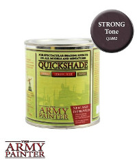
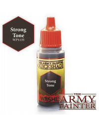
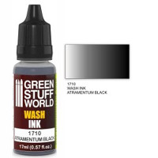
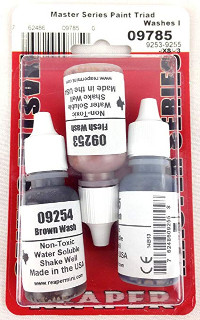
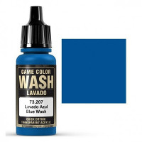

Table of Contents
=================

   * [Washes](#washes)
      * [Army Painter Quickshade](#army-painter-quickshade)
      * [Army Painter Quickshade Washes](#army-painter-quickshade-washes)
      * [Citadel Shades](#citadel-shades)
      * [Green Stuff World Washes](#green-stuff-world-washes)
      * [Oil Washes](#oil-washes)
      * [Reaper Master Series Washes](#reaper-master-series-washes)
      * [Tamiya Panel Line Accent Colors](#tamiya-panel-line-accent-colors)
      * [Vallejo Game Color Washes](#vallejo-game-color-washes)
      * [Vallejo Model Wash](#vallejo-model-wash)
      * [Warcolours Shades](#warcolours-shades)
      * [Other Wash lines](#other-wash-lines)
   * Other Articles
      * [Paints](paints.md)
      * [Metallic Paints](metallic_paints.md)
      * [Washes/Inks](washes.md)
      * [Tools](tools.md)
      * [Techniques](techniques.md)

# Washes

## Army Painter Quickshade

* Container: 250ml Can
* Cost per ml: $0.11/ml ($29.99 per can)
* Personal level of experience: Medium
* Washes in product line: 3
* Purchase: There is no set sold of these, but you can find them individually.  For example here is [Dark Tone](https://amzn.to/2MrFF88) for $23.96

Army Painter Quickshades are a fairly unique product for miniature painting.  They are fairly close in formulation to something like a Minwax wood finish.  They come in three colors: Soft Tone, Strong Tone and Dark Tone.  Dark Tone is a black wash, Strong Tone is a brown wash and Soft Tone is a Sepia Wash (or close to it).  These are intended for super fast army painting, and are a pretty heavy hammer to be hitting with.  They leave a thick gloss coat on your minis, which can be handy for protection, but honestly doesn't look awesome. That can be mitigated through matte varnishes, but still, it leaves the miniature kind of chunky.  This stuff takes about a day to fully dry.  If you plan on using it, expect to have the wash be the last step of your paint job.  I do not recommend these.  Don't confuse these with their line of Army Painter Quickshade Washes, which are quite good.

References:

* [Miniwargaming Jay: Miniature Painting 101: Part 40 - Dips](https://www.youtube.com/watch?v=QbnqzB89CzY)
* [Sorastro's Zombicide: Black Plague Painting Guide Ep.1 - The Zombies](https://www.youtube.com/watch?v=LMOTmOchKyQ)

## Army Painter Quickshade Washes

* Container: 18ml Dropper
* Cost per ml: $0.18/ml ($3.25 per dropper bottle)
* Personal level of experience: Medium
* Washes in product line: 11
* Purchase: [Army Painter Quickshade Washes Set](https://amzn.to/2MryqNM) (11 washes for $27.09)

This line of washes should not be confused with the Army Painter Quickshade product line (vs these, Army Painter Quickshade Washes, confusing, I know). This line of washes are very very close in both colors and quality to the Citadel Shades line (With probably 7 of the 11 being direct comparisons).  There are 11 colors, three of which, Soft Tone, Strong Tone and Dark tone ade designed to match up with the Quickshade of the same name.  Thye also have Green Tone, Red Tone, Blue Tone, Purple Tone, Flesh Wash, Mid Brown, Light Tone and Military Shader.

These are good washes, and frankly great for their price.  Oddly my only real complaint is that for washes, my preference reverses and I would prefer to get these in paint pots instead of droppers.  If you are on a budget, these are the go to for washes.  If you are not, you probably still want to have a set of these.

## Citadel Shades

* Container: 24ml Pot
* Cost per ml: $0.33/ml ($7.80 per Pot)
* Personal level of experience: High, None (for gloss washes)
* Washes in product line: 15, 3 of them gloss
* Purchase: [Citadel Shade Paint Set](https://amzn.to/2WKcZv7) (8 shades for $31.32) Warning with this, the pots are smaller, so it's not as good of a deal as it appears.  I would suggest just getting these shades one by one

With as much shade (ha) that I throw at the citadel layer paints, I have to grant that their washes are excellent.  People have referred to them in the past as liquid talent, and they are top notch.  They do a great job of finding recesses, and they dry to a satin, almost matte finish.  You can slop them on, and they will still generally come to a pretty decent result.  The first time you use them, they will feel a little like magic.  I find myself using at least one of Nuln Oil, Agrax Earthshade, Reikland Flesh Shade or Seraphim Sepia on nearly every model I paint.  These are my go to, with Army Painter Quickshade washes being my second most common tool I reach for when it comes to washes.

The citadel line has the following colors: Nuln Oil (Black) (also in Gloss), Agrax Earthshade (Brown) (Also in Gloss), Reilkand Fleshshade (Flesh (Also in Gloss), Seraphim Sepia (Sepia), Athonian Camoshade (green/brown), Drakenhof Niteshade (blue), Druchii Violet (Purple), Biel-tan Green (Green), Carroburg Crimson (dark pink), Fugan Orange (Orange/borwn), Casandira Yellow (Yellow/Orange) and Soelia Greenshade (blue-green).

Given my paint pot hate above, it might seem strange that I prefer this line of washes above others.  Well, shades aren't paints, and if you are going to slop on some wash, it's nice to be able to wick off the excess back into the pot.  Wash pots also don't clog up like paint pots do.  However, what citadel wash orts are famos for is spilling.  If you use these, have a tool to keep the pot upright.  This can be as simple as adding some poster tack to the bottom of the bottle.  Trust me, they are super easy to knock over.

The gloss washes are a fairly new product.  They are supposed to flow better, and work better for washing metals.  I have yet to try them, so I can't speak from experience here.

## Green Stuff World Washes

* Container: 17ml Dropper
* Cost per ml: $0.18/ml (2.69€ &#126; $3.03 per dropper)
* Personal level of experience: None
* Washes in product line: 8
* Purchase: [Set x8 Acrylic Wash Ink Paints](http://www.greenstuffworld.com/en/acrylic-inks/781-set-x8-acrylic-wash-ink-paints.html) (8 washes for 21.25€ &#126; $23.92)

Overall I've heard good stuff about these.  My impression is that one of the differences between older washes and the newer generation that seem to be substantially more useful is the transition to inks for the pigment.  The Green Stuff World Washes use ink.

Greenstuff world inks have black, red, blue, flesh, purple, green earth (brown) and sepia.  This is a pretty standard line up.

References:

* [Vince Venturella: Product Review 32 - Green Stuff World Wash](https://www.youtube.com/watch?v=iVzt6ZN-LAQ)

## Oil Washes

* Container: Any
* Cost per ml: Any
* Personl level of experience: Low

This is more a class of products than any single product.  What you do is you get a traditional oil paint, and thin it using white spirits.  You can then paint this on, and it will find the crevices far better than any acrylic paint (Oil has very low surface tension, all acrylics are based on water at some level, which has a high surface tension).  You can contiue to adjust or even wipe off the oil wash, and can do so even for days if you re-wet it using white spirits.  If you do this, be srue to use a glss or satin varnish over any acrylic paints, as this *will* pull up the paint.

References:

* [Miniwargaming Jay: Miniature Painting 101 - Part 18: Oil Washes](https://www.youtube.com/watch?v=e6F7dhabn78)
* [Paepercuts: How To Make Oil Washes For Your Miniatures](https://www.youtube.com/watch?v=7uxfqXql-gg)
* [Plasmo: How to Use Washes Oil, Tamiya panel line accent color, Citadel - Great Guide Plastic Models](https://www.youtube.com/watch?v=FXerpuOthXk)
* [Vince Venturella: Hobby Cheating 89 - How to Use Oil Washes](https://www.youtube.com/watch?v=oQmhcSRsiPo)
* [Wargamers Consortium: Washes: Using Oil Washes](https://www.youtube.com/watch?v=A2JurVVWLzY)

## Reaper Master Series Washes

* Container: 15ml Dropper
* Cost per ml: $0.22/ml ($3.29 per dropper)
* Personal level of experience: High
* Washes in product line: 6
* Purchase: [Reaper Master Series Triad Washes I](https://amzn.to/2EPYT1k) (3 bottles for $11.25) with Brown, Black and Flesh

Reaper has a fairly limited line with Flesh, Brown, Black, Sepia, Stone and Steel.  That being said, they have the clearly very important ones of Flesh, Brown, Black and Sepia.  The Stone and Steel washes are fairly interesting, as there's nothing quite like them in other lines (Stone is a little similar to Vallejo's Grey Wash).  Steel wash is sort of a blue-grey and certainly has applications.  Reaper's washes get the job done.  I find them a step below the citadel washes, but it's only a minor step.  They are still plenty useful.  The primary probme here is that the wash range is really limited, so going with a set like that from Army painter or Vallejo is going to be a better experience just due to them having a much broader pallet.

## Tamiya Panel Line Accent Colors

* Container: 40ml jar with paint brush in lid
* Cost per ml: $0.23/ml (Around $9 per jar)
* Personal level of experience: Low 
* Washes in product line: 4

These are a special product.  They are used specifically for doing panel lineing which is for draing a dark accent around the edges of say a metal panel.  They are of more use to people doing sci-fi figures than fantasy.  These are frankly magic.  You dip the included brush and then poke it in between some panels and it will pull itself along the length of that line.  If you plan on doing panel lining, these are a super asset.
o

## Vallejo Game Color Washes

* Container: 18ml Dropper
* Cost per ml: $0.19/ml ($3.29 per dropper)
* Personal level of experience: High
* Washes in product line: 8
* Purchase: [Vallejo Game Color Wash Set](https://amzn.to/2ERnsuv) (8 washes for $21.95)

Vallejo washes were the first washes I branched out to from Reaper's.  I find they are fairly similar.  They are decent, but not as good as citadel or army painter.  As time goes on, I have become more frusterated with them, as I find the pigment seperating from the medium.  All this requires to fix is a good shake, but I don't have that issue with the citadel washes.  The line is fairly standard with one oddity: Grey.

The Vallejo range is Sepia, Black, Grey, Umber, Flesh, Green, Red and Blue.

## Vallejo Model Wash

#

* Container: 35ml Dropper
* Cost per ml: $0.22/ml ($7.99 per dropper)
* Personal level of experience: Medium
* Washes in product line: 18
* Purchase: [Vallejo Dark Grey Model Wash](https://amzn.to/2WLdqoQ) ($7.99)

This wash is designed for models like vehicles.  The range is huge and has a fair number of colors that no other wash range has, including white.  The color range seems particularly focused around weathering.  I have only personally used one of these, Dark Grey on recommendation from Vince Ventrualla.  The dark grey model wash is super useful, in that it can be used more as a glaze to shade down an area.  Yes, you can use it as a wash, but for panel lining or glazing, this is a fantastic product.  At some point I will test some of the other washes in the line, but for miniature painting I can at least strongly recommend Vallejo Model Wash Dark Grey as a useful tool.

References:

* [Vince Venturella: Hobby Cheating 56 - Black Lining](https://www.youtube.com/watch?v=kl5GnGCw6Co)

## Warcolours Shades

* Container: 15ml Dropper
* Cost per ml: $0.19/ml (2.50€ &#126; $2.81 per dropper)
* Personal level of experience: Low
* Washes in product line: 7
* Purchase: [Warclours Shade Set](https://www.warcolours.com/index.php?route=product/product&path=60&product_id=150) (7 shades for 17.45€ &#126; $19.62)

These are very matte, but also fairly thick shades.  They might work like other shades if thinned, but in their out of the bottle consistency, these can't be used like traditional shades.  I think these are probably better off used as a glaze than like a wash.  As I get more experience with them, I'll circle back and reevalate them.

## Other Wash lines

There are plenty of other lines of washes.  I'll keep a list here as I find them, and expand on them when I have a chance to try them out.

<!--
# To Be Added

* Inks

References:

* [Vince Venturella: Hobby Cheating 165 - Miniature Brand Ink & Shade Guide](https://www.youtube.com/watch?v=x01-3pTktas)

## Warcolours Inks

* [Vince Venturella: Product Review 24 - Warcolours Ink Set](https://www.youtube.com/watch?v=fXtwo-ZA7fQ)

## Scale 75 Inktensity

* [Vince Venturella: Product Review 03 - Scale 75 Inktensity](https://www.youtube.com/watch?v=RAntjX9-Ke8)

## Badger Minitare Ghost Tints

* [Vince Venturella: Hobby Cheating 32 - Ghost Tints & Candy Coats](https://www.youtube.com/watch?v=bBhufU9WHjE)

* Glazes

## Warcolours Glazes

* [Vince Venturella: Product Review 27 - Warcolours Glazes](https://www.youtube.com/watch?v=P9VzeS7_vfE)

* Additives

* [Vince Venturella: Hobby Cheating 135 - Guide to Paint Additives](https://www.youtube.com/watch?v=FuSFCiLvs1w)

* Shading

* [Dr Faust's Painting Clinic: The Basics: Inks & Washes for Miniatures](https://www.youtube.com/watch?v=vuTCEzyZ50o)
* [Miniac: Episode 05: Shading](https://www.youtube.com/watch?v=EdbWckTKDmk)
* [Miniwargaming Jay: Miniature Painting 101 - Part 10 - Washes and Shades](https://www.youtube.com/watch?v=Ke2UMbMPN9w)
* [Miniwargaming Jay: Miniature Painting 101: Part 17 - Shading](https://www.youtube.com/watch?v=i7lBNjOVjLU)

* Glazing

* [Miniac: How to Glaze](https://www.youtube.com/watch?v=4ePwy9qED28)
* [Miniwargmaing Jay: Miniature Painting 101 - Part 12 - Glazes](https://www.youtube.com/watch?v=gzaxN4J69s0)
* [Miniwargaming Jay: Miniature Painting 101: Part 134 - Glazing](https://www.youtube.com/watch?v=DfJlGopB2Sg)
* [Vince Venturella: Hobby Cheating 02 - Undershading & Glazes](https://www.youtube.com/watch?v=4ZFXSE9UHUM)
* [Vince Venturella: Hobby Cheating 10 - Technique Tips - Washes, Glazes & Drybrush](https://www.youtube.com/watch?v=qaARYpmCyC4)
* [Vince Venturella: Hobby Cheating 31 - Blending - Glazes, Two Brush, Feathering & Loaded Brush](https://www.youtube.com/watch?v=70A3_bHGMGc)
* [Vince Venturella: Hobby Cheating 122 - How to Glaze](https://www.youtube.com/watch?v=N88NtHNmz1Q)

* Zenithal Priming + Glazing

* [Ghool's Painting Tips: Speed Painting - Zenithal Prime and Glazing](https://www.youtube.com/watch?v=SvJjD6Hm1Es)
* [Miniac: Speedpaint Minis Without Losing Quality!](https://www.youtube.com/watch?v=vGOmSKO_KaU)
* [Sorastro's Blood Rage Painting Guide Ep.1: The Frost Giant](https://www.youtube.com/watch?v=RtHbIfyQHBU)
* [Tabletop Minons: Understanding Underpainting](https://www.youtube.com/watch?v=Wxc9WX2INp4)
* [Vince Venturella: Hobby Cheating 07 - Zenithal Highlighting & Ghosts](https://www.youtube.com/watch?v=1nDvWs4dsfc)
* [Vince Venturella: Hobby Cheating 11 - Zenithal Highlighting Next Steps](https://www.youtube.com/watch?v=hCafLRStALA)
* [Vince Venturella: Hobby Cheating 74 - Speed Painting with Washes, Shades & Inks](https://www.youtube.com/watch?v=1YdY7GlwKQc)
* [Vince Venturella: Hobby Cheating 75 - Zenithal Highlighting and Glazes](https://www.youtube.com/watch?v=J-dQU-dSNa8)
* [Vince Venturella: Hobby Cheating 104 - Zenithal Speed Painting w True Metals](https://www.youtube.com/watch?v=ByX2jIEmXJM)
* [Vince Venturella: Hobby Cheating 105 - Zenithal Speed Painting Gold True Metals](https://www.youtube.com/watch?v=agRmMwuQI5A)
* [Vince Venturella: Hobby Cheating 123 - Warm Zenithal Highlighting](https://www.youtube.com/watch?v=rFDHpVJiNC0)
* [Vince Venturella: Hobby Cheating 136 - Guide to Value Sketching](https://www.youtube.com/watch?v=n0CFC2soR18)
* [Vince Venturella: Hobby Cheating 175 - Understanding Unusual Undershading & Zenithal Highlighting](https://www.youtube.com/watch?v=Doc2GdL2Lv4)
-->
