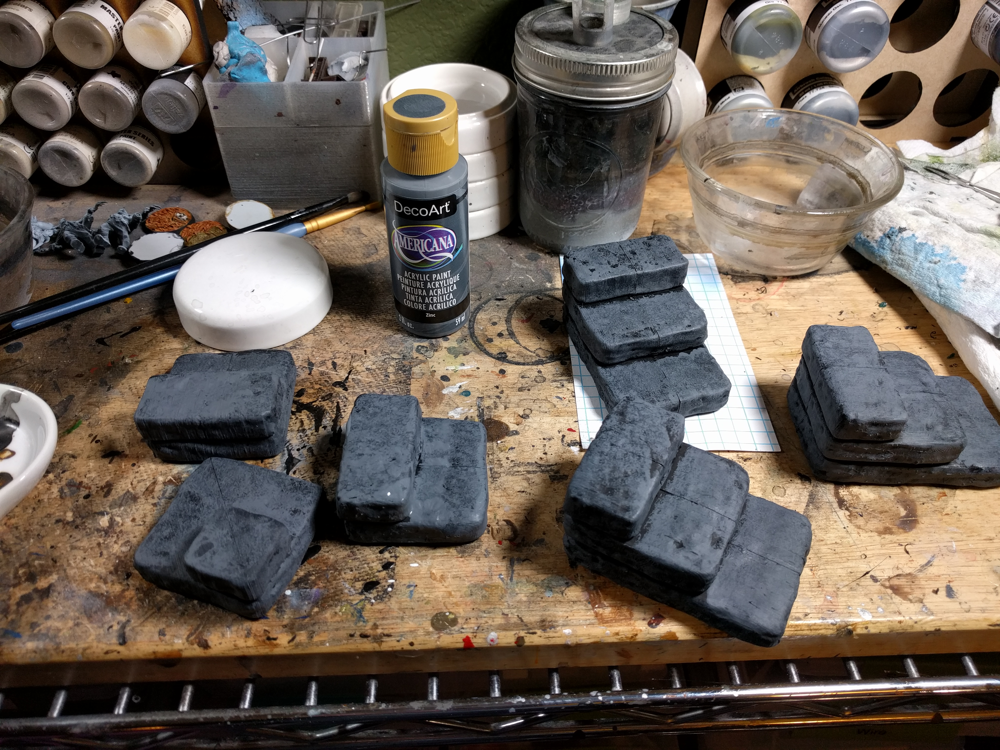
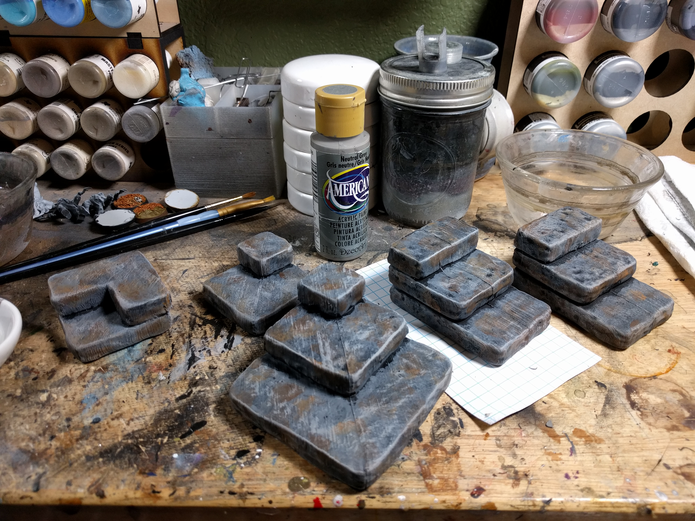

#Painting the dungeon stackers

You need the following:

* [Krylon Fusion](http://amzn.to/2C8XG0L) Flat Black Camo Primer (or other black primer)
* Americana [Zinc](http://amzn.to/2BmC6t2) (or other dark grey)
* Americana [Burnt Umber](http://amzn.to/2HbRqZR) (or other dark brown)
* Americana [Honey Brown](http://amzn.to/2BmMi4O) (or other light brown)
* Americana [Slate Grey](http://amzn.to/2C89rVe) or [Neutral Grey](http://amzn.to/2Eed16e) (or other light grey)
* A [paint sponge](http://amzn.to/2EEMa2A)

Sadly, my first pictures are lost, so here's the summary:

* Glue the dungeon stackers together, using a hobby knife to smooth the seams (and putty if you want for additional smoothing).
* Prime them with black spray primer (I use Krylon Flat Black Camo Primer).

 |
--------------------------------------------
Sponge on the dark grey heavily. |

* Do a lighter sponge on of the dark brown

* Do an even lighter sponging on of the light brown

* dry brush on your light grey, trying to catch the edges as much as you can.

